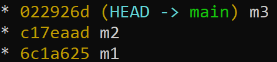
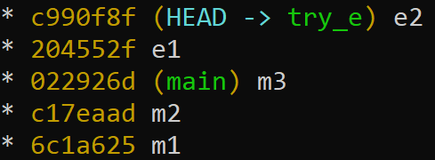
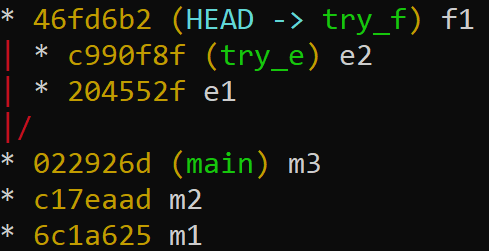
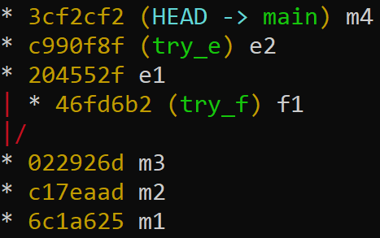
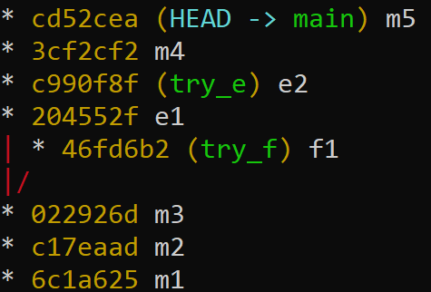
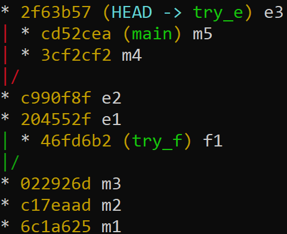
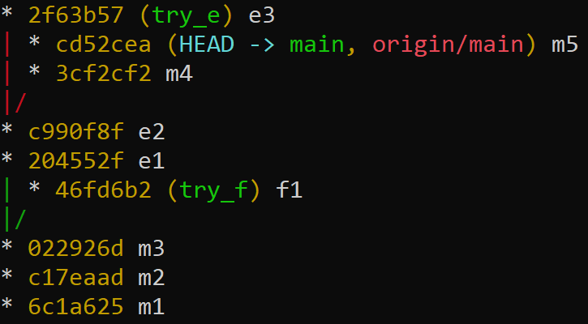
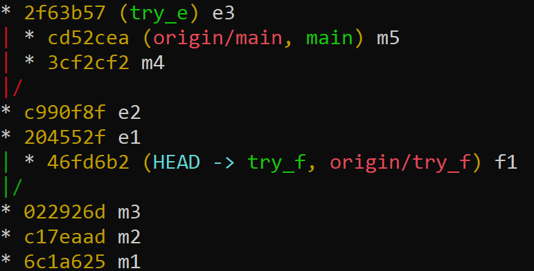
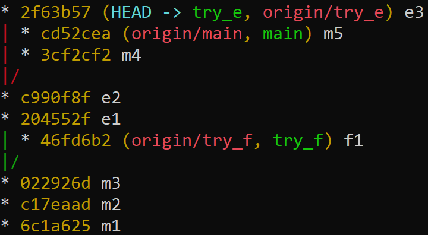

## Git branching example

```
git commit -a -m "m1"
git commit -a -m "m2"
git commit -a -m "m3"
git log --graph --oneline --all --decorate 
```




```
git branch try_e
git switch try_e
git commit -a -m "e1"
git commit -a -m "e2"
git log --graph --oneline --all --decorate 
```




```
git switch main
git branch try_f
git switch try_f
git commit -a -m "f1"
git log --graph --oneline --all --decorate 
```




```
git switch main
git merge try_e
git commit -a -m "m4"
git log --graph --oneline --all --decorate 
```




```
git commit -a -m "m5"
git log --graph --oneline --all --decorate 
```




```
git switch try_e
git commit -a -m "e3"
git log --graph --oneline --all --decorate 
```




```
git switch main
git push
git log --graph --oneline --all --decorate 
```




```
git switch try_f
git push --set-upstream origin try_f
git log --graph --oneline --all --decorate 
```




```
git switch try_e
git push --set-upstream origin try_e
git log --graph --oneline --all --decorate 
```



